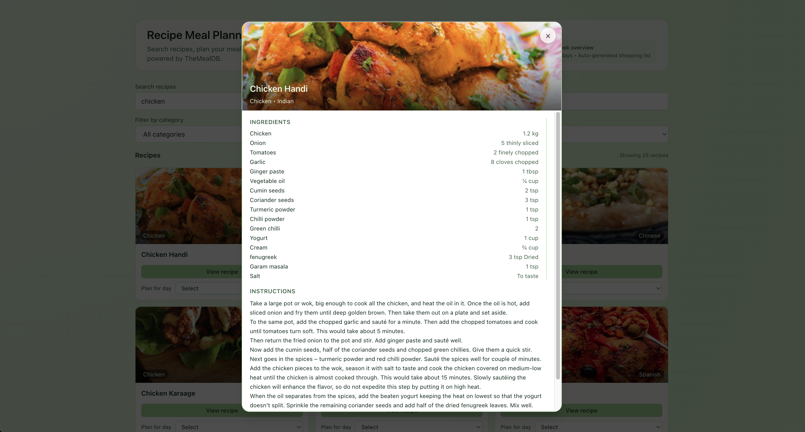
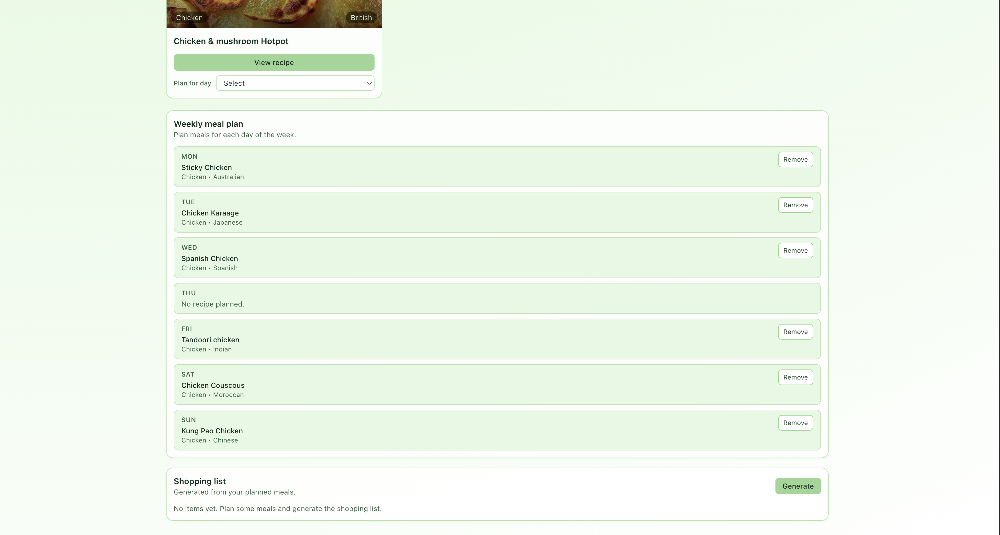
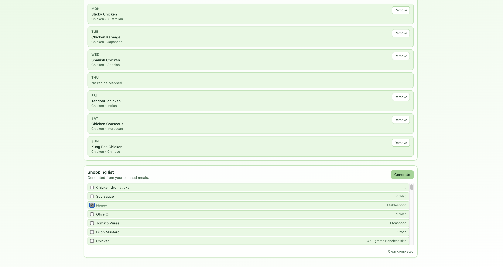
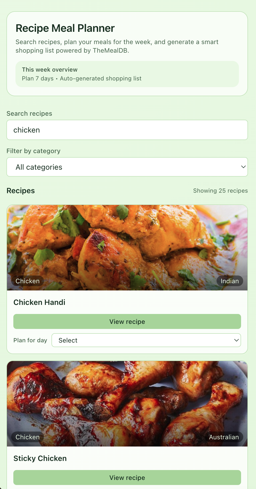

## Recipe Meal Planner - Take-Home Project

## 🎯 Project Overview

A meal planning app where users can:

1. Search and browse recipes.
2. View recipe details with ingredients.
3. Plan meals for the week (7 days).
4. Generate a shopping list from planned meals.

**API:** TheMealDB (Free, no key needed — simply use the dev account) - https://www.themealdb.com/api.php

---

### Features

1. **Recipe Search** _(Status: ✅ Implemented via `useDebouncedValue` + `useRecipes`)_

   1. Search by recipe name.
   2. Filter by category (dropdown).
   3. Display results in a grid with image, name, category (`RecipeCard`).

2. **Recipe Details** _(Status: ✅ Implemented via `RecipeDetailsModal`)_

   1. Show full recipe (ingredients, instructions, image).
   2. Displayed inside an accessible modal with keyboard support.

3. **Weekly Meal Plan** _(Status: ✅ Implemented via `WeeklyMealPlanner` + Context)_

   1. 7-day calendar (Mon-Sun).
   2. Add recipe to any day.
   3. Remove recipe from a day, with toast feedback.

4. **Shopping List** _(Status: ✅ Implemented via `ShoppingListPanel` + `useMealPlan`)_
   1. Auto-generate from all planned meals (parallel detail fetches).
   2. Checkbox to mark items as purchased.
   3. Clear completed items.

---

## 🔌 API Endpoints

```bash
# Search recipes
GET https://www.themealdb.com/api/json/v1/1/search.php?s=chicken

# Get recipe details
GET https://www.themealdb.com/api/json/v1/1/lookup.php?i=52772

# List categories
GET https://www.themealdb.com/api/json/v1/1/categories.php

# Filter by category
GET https://www.themealdb.com/api/json/v1/1/filter.php?c=Seafood
```

**Note:** TheMealDB is free but has rate limits. The app includes error handling for 429 (Too Many Requests) responses with user-friendly messages. See `utils/api.ts` for implementation details.

---

## 📊 Data Structure Example

```tsx
export interface Ingredient {
  name: string;
  measure: string;
}

export interface Recipe {
  id: string;
  name: string;
  category: string;
  area: string;
  instructions: string;
  thumbnail: string;
  ingredients: Ingredient[];
}

export type DayOfWeek = 'Mon' | 'Tue' | 'Wed' | 'Thu' | 'Fri' | 'Sat' | 'Sun';

export type MealPlan = Record<DayOfWeek, Recipe | null>;
```

---

## 📁 Expected Project Structure

```
src/
├── components/      # React components
├── hooks/           # Custom hooks (useRecipes, useRecipeDetails, useMealPlan)
├── context/         # State management (Context API)
├── types/           # TypeScript interfaces
├── utils/           # Helper functions
└── App.tsx
```

---

## Setup & Run

1. **Prerequisites:** Node.js v22.19.0 and npm.
2. **Installation:** `npm install`
3. **Environment variables:** Not required (TheMealDB is public).
4. **Run locally:** `npm run dev` then open the printed Vite URL.
5. **Build:** `npm run build`
6. **Preview production build:** `npm run preview`

---

## Architecture Overview

1. Folder structure follows the `components | hooks | context | types | utils` separation for clarity.
2. State management uses React Context + reducer (`MealPlanContext`) to share the weekly plan and shopping list across the tree while persisting to `localStorage`.
3. Custom hooks (`useRecipes`, `useRecipeDetails`, `useMealPlan`, `useDebouncedValue`) encapsulate async data fetching, derived state, and debounced inputs, keeping components lean.

---

## Technical Decisions

1. **Libraries & tooling:** React 19 + Vite 7 for fast DX, Tailwind utility classes for rapid styling, and `sonner` for lightweight toasts.
2. **Patterns:** Context + reducer for predictable state transitions; hooks for fetch logic + side effects; Presentational components stay stateless.
3. **Error handling:** Centralized API error handling with `fetchWithErrorHandling` wrapper that detects rate limits (429) and other HTTP errors, providing user-friendly messages. Custom `ApiError` class extends Error for better error tracking.
4. **Trade-offs & future work:** Could add pagination, category caching, optimistic UI for shopping toggles, or move to TanStack Query for smarter caching.

---

## Time Breakdown

```markdown
| Task              | Time Spent  |
| ----------------- | ----------- |
| Setup & structure | 50 min      |
| Custom hooks      | 120 min     |
| State management  | 120 min     |
| UI components     | 180 min     |
| API integration   | 120 min     |
| Testing & fixes   | 60 min      |
| **Total**         | **10h 50m** |
```

---

## Challenges Faced

1. **Designing a clean data model from TheMealDB responses**
   The raw API shape (20 separate ingredient/measure fields per meal) is not convenient for React components.
   I solved this by adding a small mapping layer in `utils/api.ts` that normalizes each meal into a `Recipe` object with a typed `ingredients: Ingredient[]` array, which made the UI and hooks much simpler.

2. **Coordinating multiple async calls for the shopping list**
   Generating a list from all planned meals requires fetching detailed recipe data for each selected id.
   I used `Promise.all` inside `useMealPlan.generateShoppingList` to run these requests in parallel, then deduplicated items by a stable key of `name+measure` to avoid duplicates in the UI.

3. **Persisting state without breaking server-side safety**
   Accessing `localStorage` directly can fail in non-browser contexts.
   I introduced a `getInitialState` helper in `MealPlanContext` that guards on `typeof window !== 'undefined'` and wraps reads/writes in `try/catch`, so the app stays robust while still persisting the meal plan.

4. **Handling API rate limits gracefully**
   TheMealDB has rate limits that can return 429 (Too Many Requests) responses.
   I implemented a centralized `fetchWithErrorHandling` function in `utils/api.ts` that detects 429 status codes and throws a custom `ApiError` with a user-friendly message. All API calls now use this wrapper, ensuring consistent error handling across the app.

5. **Balancing loading states and perceived performance**
   Plain spinners felt jarring when fetching recipes or details.
   I replaced them with lightweight skeleton loaders in `App.tsx` and `RecipeDetailsModal`, and added debounced search input so the app doesn’t refetch on every keystroke.

---

## Screenshots

- Recipe search/browse page
  
- Recipe details view
  
- Weekly meal plan
  
- Shopping list
  
- Mobile responsive view
  

---

## Code Quality Checklist

- [x] Project builds without errors: `npm run build`
- [x] No TypeScript errors (if TypeScript is used): `npm run type-check`
- [x] No ESLint warnings (critical ones fixed)
- [x] All 3 custom hooks implemented (`useRecipes`, `useRecipeDetails`, `useMealPlan`)
- [x] Parallel API calls in shopping list (`useMealPlan.generateShoppingList`)
- [x] Loading states for all async operations (`useRecipes`, `useRecipeDetails`, `<RecipeList>`)
- [x] Error handling for failed API calls
- [x] API rate limit handling (429 responses) with user-friendly messages
- [x] Responsive on mobile (320px) and desktop (1024px+)

---

## ✨ Bonus Points (Optional)

Already implemented.

1. Local storage persistence for meal plan _(Status: ✅ Implemented via `MealPlanProvider`)_
2. Debounced search input _(Status: ✅ Implemented via `useDebouncedValue`)_
3. Loading skeletons instead of spinners _(Status: ✅ Implemented in `App.tsx` + `RecipeDetailsModal`)_
4. Empty states with helpful messages _(Status: ✅ Implemented in recipes + shopping list panels)_
5. Recipe card hover effects _(Status: ✅ Implemented in `RecipeCard`)_
